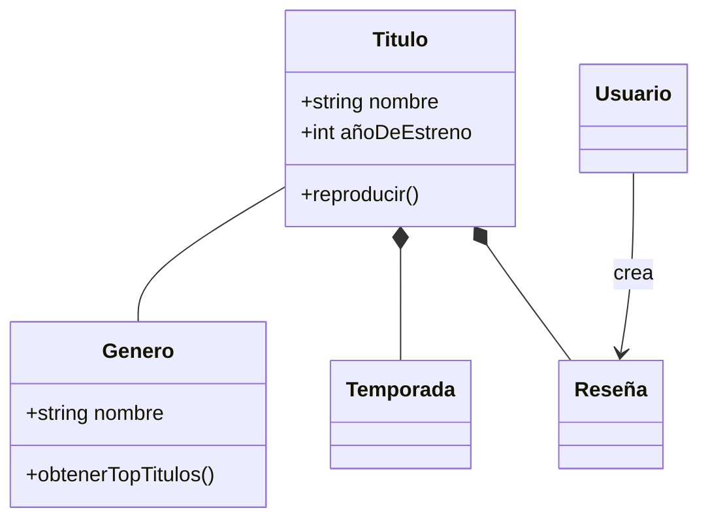
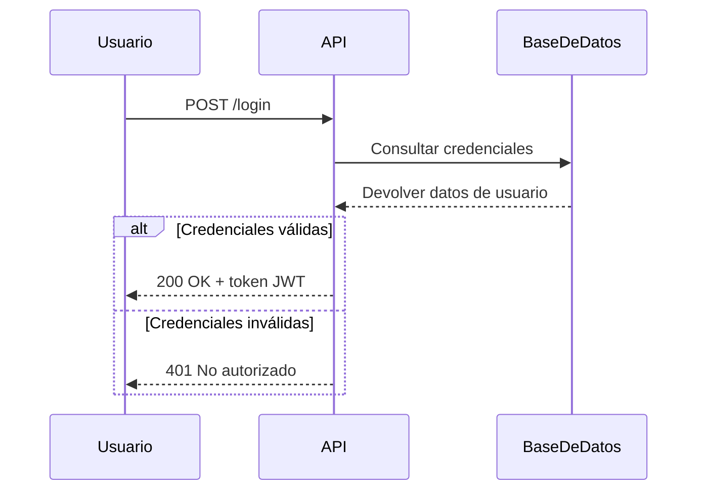
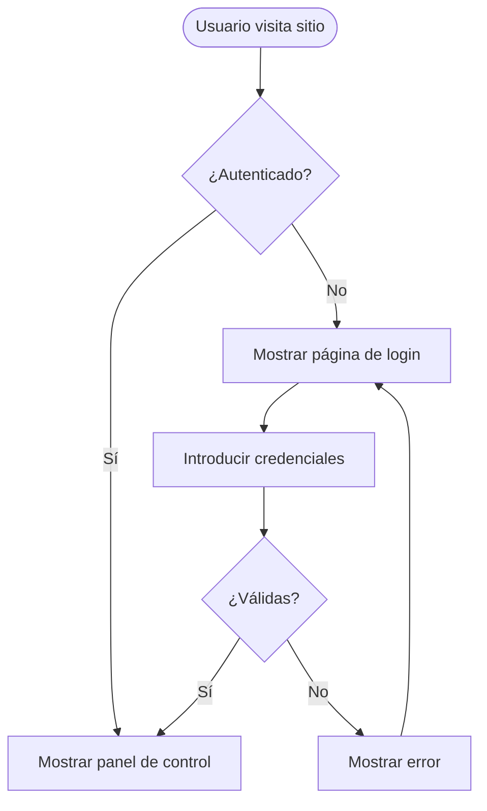
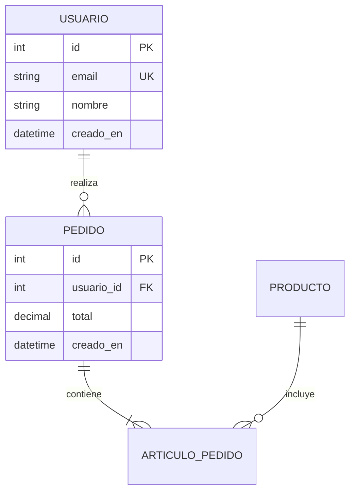
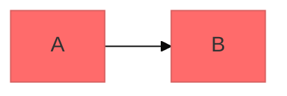

# Creación de Diagramas con Mermaid

Crea diagramas de software profesionales utilizando la sintaxis basada en texto de Mermaid. Mermaid renderiza diagramas a partir de definiciones de texto simples, lo que permite que los diagramas tengan control de versiones, sean fáciles de actualizar y se mantengan junto con el código.

## Estructura de Sintaxis Principal

Todos los diagramas de Mermaid siguen este patrón:

```mermaid
tipoDeDiagrama
  contenido de la definición
```

**Principios clave:**

- La primera línea declara el tipo de diagrama (ej., `classDiagram`, `sequenceDiagram`, `flowchart`).
- Usa `%%` para comentarios.
- Los saltos de línea y la sangría mejoran la legibilidad pero no son estrictamente obligatorios.
- Las palabras desconocidas rompen los diagramas; los parámetros fallan silenciosamente.

## Guía de Selección del Tipo de Diagrama

**Elige el tipo de diagrama adecuado:**

1. **Diagramas de Clases** - Modelado de dominio, diseño orientado a objetos (OOP), relaciones entre entidades.
   - Documentación de diseño guiado por el dominio (DDD).
   - Estructuras de clases orientadas a objetos.
   - Relaciones de identidad y dependencias.

2. **Diagramas de Secuencia** - Interacciones temporales, flujos de mensajes.
   - Flujos de solicitud/respuesta de API.
   - Flujos de autenticación de usuario.
   - Interacciones entre componentes del sistema.
   - Secuencias de llamadas a métodos.

3. **Diagramas de Flujo (Flowcharts)** - Procesos, algoritmos, árboles de decisión.
   - Viajes del usuario (user journeys) y flujos de trabajo (workflows).
   - Procesos de negocio.
   - Lógica de algoritmos.
   - Tuberías (pipelines) de despliegue.

4. **Diagramas de Relación de Entidades (ERD)** - Esquemas de bases de datos.
   - Relaciones entre tablas.
   - Modelado de datos.
   - Diseño de esquemas.

5. **Diagramas C4** - Arquitectura de software en múltiples niveles.
   - Contexto del sistema (sistemas y usuarios).
   - Contenedor (aplicaciones, bases de datos, servicios).
   - Componente (estructura interna).
   - Código (nivel de clase/interfaz).

6. **Diagramas de Estado** - Máquinas de estado, estados del ciclo de vida.
7. **Git Graphs** - Estrategias de ramificación (branching) en control de versiones.
8. **Diagramas de Gantt** - Cronogramas de proyectos, programación.
9. **Gráficos Circulares/de Barras** - Visualización de datos.

## Ejemplos de Inicio Rápido

### Diagrama de Clases (Modelo de Dominio)



### Diagrama de Secuencia (Flujo de API)



### Diagrama de Flujo (Viaje del Usuario)



### ERD (Esquema de Base de Datos)



## Referencias Detalladas

Para una guía profunda sobre tipos específicos de diagramas, consulta:

- **[references/class-diagrams.md](references/class-diagrams.md)** - Modelado de dominio, relaciones (asociación, composición, agregación, herencia), multiplicidad, métodos/propiedades.
- **[references/sequence-diagrams.md](references/sequence-diagrams.md)** - Actores, participantes, mensajes (sincrónicos/asincrónicos), activaciones, bucles, bloques alt/opt/par, notas.
- **[references/flowcharts.md](references/flowcharts.md)** - Formas de nodos, conexiones, lógica de decisión, subgrafos, estilos.
- **[references/erd-diagrams.md](references/erd-diagrams.md)** - Entidades, relaciones, cardinalidad, claves, atributos.
- **[references/c4-diagrams.md](references/c4-diagrams.md)** - Contexto del sistema, contenedor, diagramas de componentes, límites (boundaries).
- **[references/advanced-features.md](references/advanced-features.md)** - Temas, estilos, configuración, opciones de diseño (layout).

## Mejores Prácticas

1. **Empieza de forma simple** - Comienza con las entidades/componentes centrales y añade detalles de forma incremental.
2. **Usa nombres significativos** - Las etiquetas claras hacen que los diagramas se documenten solos.
3. **Comenta extensamente** - Usa comentarios `%%` para explicar relaciones complejas.
4. **Mantén el enfoque** - Un diagrama por concepto; divide los diagramas grandes en múltiples vistas enfocadas.
5. **Control de versiones** - Almacena los archivos `.mmd` junto con el código para facilitar las actualizaciones.
6. **Añade contexto** - Incluye títulos y notas para explicar el propósito del diagrama.
7. **Itera** - Refina los diagramas a medida que evoluciona el entendimiento.

## Configuración y Temas

Configura los diagramas utilizando frontmatter:



**Temas disponibles:** default, forest, dark, neutral, base.

**Opciones de diseño (Layout):**

- `layout: dagre` (por defecto) - Diseño clásico equilibrado.
- `layout: elk` - Diseño avanzado para diagramas complejos (requiere integración).

**Opciones de apariencia (Look):**

- `look: classic` - Estilo tradicional de Mermaid.
- `look: handDrawn` - Apariencia de dibujo a mano.

## Exportación y Renderizado

**Soporte nativo en:**

- GitHub/GitLab - Se renderiza automáticamente en Markdown.
- VS Code - Con la extensión Markdown Mermaid.
- Notion, Obsidian, Confluence - Soporte integrado.

**Opciones de exportación:**

- [Mermaid Live Editor](https://mermaid.live) - Editor online con exportación PNG/SVG.
- Mermaid CLI - `npm install -g @mermaid-js/mermaid-cli` y luego `mmdc -i entrada.mmd -o salida.png`.
- Docker - `docker run --rm -v $(pwd):/data minlag/mermaid-cli -i /data/entrada.mmd -o /data/salida.png`.

## Errores Comunes (Pitfalls)

- **Caracteres que rompen** - Evita `{}` en los comentarios, usa secuencias de escape adecuadas para caracteres especiales.
- **Errores de sintaxis** - Los errores de ortografía rompen los diagramas; valida la sintaxis en Mermaid Live.
- **Excesiva complejidad** - Divide los diagramas complejos en múltiples vistas enfocadas.
- **Relaciones faltantes** - Documenta todas las conexiones importantes entre las entidades.

## Cuándo Crear Diagramas

**Diagrama siempre cuando:**

- Empieces nuevos proyectos o características.
- Documentes sistemas complejos.
- Expliques decisiones de arquitectura.
- Diseñes esquemas de bases de datos.
- Planifiques esfuerzos de refactorización.
- Realices el onboarding (incorporación) de nuevos miembros del equipo.

**Usa diagramas para:**

- Alinear a los interesados (stakeholders) en decisiones técnicas.
- Documentar modelos de dominio de manera colaborativa.
- Visualizar flujos de datos e interacciones de sistemas.
- Planificar antes de programar.
- Crear documentación "viva" que evolucione con el código.
