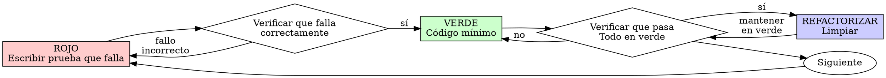

# Desarrollo Dirigido por Pruebas (TDD)

## Descripción General

Escribe primero la prueba. Mira cómo falla. Escribe el código mínimo para que pase.

**Principio fundamental:** Si no viste fallar la prueba, no sabes si está probando lo correcto.

**Violar la letra de las reglas es violar el espíritu de las reglas.**

## Cuándo usar

**Siempre:**

- Nuevas características
- Corrección de errores
- Refactorización
- Cambios de comportamiento

**Excepciones (pregunta a tu compañero humano):**

- Prototipos desechables
- Código generado
- Archivos de configuración

¿Pensando en "saltarte el TDD solo esta vez"? Detente. Eso es una racionalización.

## La Ley de Hierro

```
NO ESCRIBAS CÓDIGO DE PRODUCCIÓN SIN UNA PRUEBA QUE FALLE PRIMERO
```

¿Escribiste código antes que la prueba? Bórralo. Empieza de nuevo.

**Sin excepciones:**

- No lo guardes como "referencia"
- No lo "adaptes" mientras escribes las pruebas
- No lo mires
- Borrar significa borrar

Implementa de cero a partir de las pruebas. Punto.

## Rojo-Verde-Refactorización (Red-Green-Refactor)



### ROJO - Escribir prueba que falla

Escribe una prueba mínima que muestre lo que debería suceder.

<Bien>
```typescript
test('reintenta operaciones fallidas 3 veces', async () => {
  let intentos = 0;
  const operacion = () => {
    intentos++;
    if (intentos < 3) throw new Error('fallo');
    return 'éxito';
  };

const resultado = await reintentarOperacion(operacion);

expect(resultado).toBe('éxito');
expect(intentos).toBe(3);
});

````
Nombre claro, prueba el comportamiento real, una sola cosa.
</Bien>

<Mal>
```typescript
test('el reintento funciona', async () => {
  const mock = jest.fn()
    .mockRejectedValueOnce(new Error())
    .mockRejectedValueOnce(new Error())
    .mockResolvedValueOnce('éxito');
  await reintentarOperacion(mock);
  expect(mock).toHaveBeenCalledTimes(3);
});
````

Nombre vago, prueba el mock en lugar del código.
</Mal>

**Requisitos:**

- Un solo comportamiento
- Nombre claro
- Código real (nada de mocks a menos que sea inevitable)

### Verificar ROJO - Mira cómo falla

**OBLIGATORIO. Nunca te lo saltes.**

```bash
npm test ruta/a/prueba.test.ts
```

Confirma que:

- La prueba falla (no lanza un error de ejecución inesperado)
- El mensaje de fallo es el esperado
- Falla porque falta la característica (no por errores tipográficos)

**¿La prueba pasa?** Estás probando un comportamiento ya existente. Corrige la prueba.

**¿La prueba da error?** Corrige el error, vuelve a ejecutar hasta que falle correctamente.

### VERDE - Código mínimo

Escribe el código más simple para que la prueba pase.

<Bien>
```typescript
async function reintentarOperacion<T>(fn: () => Promise<T>): Promise<T> {
  for (let i = 0; i < 3; i++) {
    try {
      return await fn();
    } catch (e) {
      if (i === 2) throw e;
    }
  }
  throw new Error('inalcanzable');
}
```
Solo lo necesario para pasar.
</Bien>

<Mal>
```typescript
async function reintentarOperacion<T>(
  fn: () => Promise<T>,
  opciones?: {
    maxReintentos?: number;
    espera?: 'lineal' | 'exponencial';
    alReintentar?: (intento: number) => void;
  }
): Promise<T> {
  // YAGNI (No lo vas a necesitar)
}
```
Exceso de ingeniería.
</Mal>

No añadidas características, no refactorices otro código ni "mejores" más allá de lo que pide la prueba.

### Verificar VERDE - Mira cómo pasa

**OBLIGATORIO.**

```bash
npm test ruta/a/prueba.test.ts
```

Confirma que:

- La prueba pasa
- El resto de las pruebas siguen pasando
- La salida sea limpia (sin errores ni advertencias)

**¿La prueba falla?** Corrige el código, no la prueba.

**¿Fallan otras pruebas?** Corrígelas ahora mismo.

### REFACTORIZAR - Limpiar

Solo después de estar en verde:

- Elimina duplicidad
- Mejora los nombres
- Extrae ayudantes (helpers)

Mantén las pruebas en verde. No añadas comportamiento nuevo.

### Repetir

Siguiente prueba que falle para la siguiente característica.

## Buenas Pruebas

| Calidad               | Bien                                        | Mal                                                   |
| --------------------- | ------------------------------------------- | ----------------------------------------------------- |
| **Mínima**            | Una sola cosa. ¿"y" en el nombre? Divídela. | `test('valida email y dominio y espacios en blanco')` |
| **Clara**             | El nombre describe el comportamiento        | `test('prueba1')`                                     |
| **Muestra intención** | Demuestra la API deseada                    | Oscurece lo que el código debería hacer               |

## Por qué importa el orden

**"Escribiré las pruebas después para verificar que funciona"**

Las pruebas escritas después del código pasan inmediatamente. Pasar inmediatamente no demuestra nada:

- Podrías estar probando lo incorrecto.
- Podrías estar probando la implementación, no el comportamiento.
- Podrías pasar por alto casos de borde que olvidaste.
- Nunca viste cómo la prueba detectaba el error.

Escribir la prueba primero te obliga a verla fallar, demostrando que realmente prueba algo.

**"Ya probé manualmente todos los casos de borde"**

Las pruebas manuales son ad-hoc. Crees que lo has probado todo pero:

- No hay registro de lo que probaste.
- No puedes volver a ejecutarlas cuando el código cambie.
- Es fácil olvidar casos bajo presión.
- "Funcionó cuando lo probé" ≠ exhaustivo.

Las pruebas automatizadas son sistemáticas. Se ejecutan de la misma manera cada vez.

**"Borrar X horas de trabajo es un desperdicio"**

Falacia del costo hundido. Ese tiempo ya se fue. Tu elección ahora es:

- Borrar y reescribir con TDD (X horas más, alta confianza).
- Quedártelo y añadir pruebas después (30 min, baja confianza, errores probables).

El "desperdicio" es mantener código en el que no puedes confiar. El código que funciona sin pruebas reales es deuda técnica.

**"TDD es dogmático, ser pragmático significa adaptarse"**

TDD ES pragmático:

- Encuentra errores antes del commit (más rápido que depurar después).
- Previene regresiones (las pruebas detectan roturas inmediatamente).
- Documenta el comportamiento (las pruebas muestran cómo usar el código).
- Permite refactorizar (cambia libremente, las pruebas detectan fallos).

Atajos "pragmáticos" = depurar en producción = más lento.

**"Las pruebas posteriores logran los mismos objetivos; se trata del espíritu, no del ritual"**

No. Las pruebas posteriores responden a "¿Qué hace esto?". El TDD responde a "¿Qué debería hacer esto?".

Las pruebas posteriores están sesgadas por tu implementación. Pruebas lo que construiste, no lo que se requiere. Verificas los casos de borde recordados, no los descubiertos.

El TDD fuerza el descubrimiento de casos de borde antes de implementar. Las pruebas posteriores verifican que recordaste todo (y no fue así).

30 minutos de pruebas posteriores ≠ TDD. Obtienes cobertura, pierdes la prueba de que las pruebas funcionan.

## Racionalizaciones comunes

| Excusa                                                   | Realidad                                                              |
| -------------------------------------------------------- | --------------------------------------------------------------------- |
| "Demasiado simple para probar"                           | El código simple se rompe. La prueba tarda 30 segundos.               |
| "Probaré después"                                        | Las pruebas que pasan inmediatamente no demuestran nada.              |
| "Las pruebas posteriores logran lo mismo"                | Después = "¿qué hace esto?". Antes = "¿qué debería hacer esto?"       |
| "Ya lo probé manualmente"                                | Ad-hoc ≠ sistemático. Sin registro, no se puede repetir.              |
| "Borrar X horas es un desperdicio"                       | Falacia del costo hundido. El código no verificado es deuda técnica.  |
| "Me lo quedo de referencia, escribiré la prueba primero" | Acabarás adaptándolo. Eso es probar después. Borrar significa borrar. |
| "Necesito explorar primero"                              | Perfecto. Desecha la exploración, empieza con TDD.                    |
| "Prueba difícil = diseño poco claro"                     | Escucha a la prueba. Si es difícil de probar, es difícil de usar.     |
| "El TDD me retrasará"                                    | El TDD es más rápido que depurar. Pragmático = empezar por la prueba. |
| "La prueba manual es más rápida"                         | El manual no demuestra casos de borde. Re-probarás en cada cambio.    |
| "El código existente no tiene pruebas"                   | Lo estás mejorando. Añade pruebas para el código existente.           |

## Banderas Rojas - DETENTE y empieza de nuevo

- Código antes que la prueba.
- Prueba después de la implementación.
- La prueba pasa inmediatamente.
- No puedes explicar por qué falló la prueba.
- Pruebas añadidas "más tarde".
- Racionalizar "solo esta vez".
- "Ya lo probé manualmente".
- "Las pruebas posteriores cumplen el mismo propósito".
- "Se trata del espíritu, no del ritual".
- "Guardar como referencia" o "adaptar código existente".
- "Ya pasé X horas, borrar es un desperdicio".
- "TDD es dogmático, yo soy pragmático".
- "Esto es diferente porque...".

**Todo esto significa: Borra el código. Empieza de nuevo con TDD.**

## Ejemplo: Corrección de un error (Bug Fix)

**Error:** Se acepta un correo electrónico vacío.

**ROJO**

```typescript
test("rechaza correo vacío", async () => {
  const resultado = await enviarFormulario({ email: "" });
  expect(resultado.error).toBe("Email requerido");
});
```

**Verificar ROJO**

```bash
$ npm test
FAIL: expected 'Email requerido', got undefined
```

**VERDE**

```typescript
function enviarFormulario(data: FormData) {
  if (!data.email?.trim()) {
    return { error: "Email requerido" };
  }
  // ...
}
```

**Verificar VERDE**

```bash
$ npm test
PASS
```

**REFACTORIZAR**
Extraer la validación para múltiples campos si es necesario.

## Lista de verificación (Checklist)

Antes de marcar el trabajo como completado:

- [ ] Cada nueva función/método tiene una prueba.
- [ ] Has visto fallar cada prueba antes de implementar.
- [ ] Cada prueba falló por la razón esperada (característica faltante, no error tipográfico).
- [ ] Escribiste el código mínimo para pasar cada prueba.
- [ ] Todas las pruebas pasan.
- [ ] La salida es limpia (sin errores ni advertencias).
- [ ] Las pruebas usan código real (mocks solo si es inevitable).
- [ ] Se cubren los casos de borde y los errores.

¿No puedes marcar todas las casillas? Te saltaste el TDD. Empieza de nuevo.

## En caso de atascarse

| Problema                       | Solución                                                                             |
| ------------------------------ | ------------------------------------------------------------------------------------ |
| No sé cómo probarlo            | Escribe la API deseada. Escribe primero la aserción. Pregunta a tu compañero humano. |
| Prueba demasiado complicada    | Diseño demasiado complicado. Simplifica la interfaz.                                 |
| Debo usar mocks para todo      | Código demasiado acoplado. Usa inyección de dependencias.                            |
| Configuración de prueba enorme | Extrae ayudantes. ¿Sigue siendo compleja? Simplifica el diseño.                      |

## Integración con la depuración

¿Encontraste un error? Escribe una prueba que lo reproduzca. Sigue el ciclo de TDD. La prueba demuestra el arreglo y previene la regresión.

Nunca arregles errores sin una prueba.

## Anti-patrones de pruebas

Al añadir mocks o utilidades de prueba, lee `@testing-anti-patterns.md` para evitar errores comunes:

- Probar el comportamiento del mock en lugar del comportamiento real.
- Añadir métodos solo para pruebas a clases de producción.
- Usar mocks sin entender las dependencias.

## Regla Final

```
Código de producción → existe una prueba que falló primero
De lo contrario → no es TDD
```

Sin excepciones sin el permiso de tu compañero humano.
