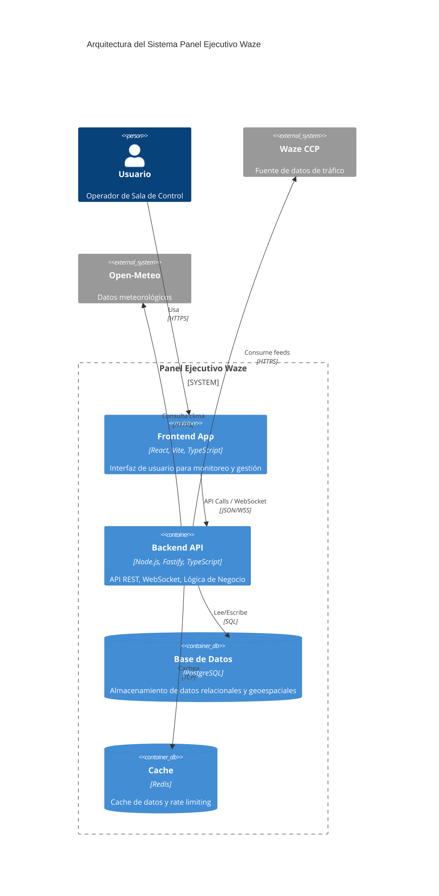
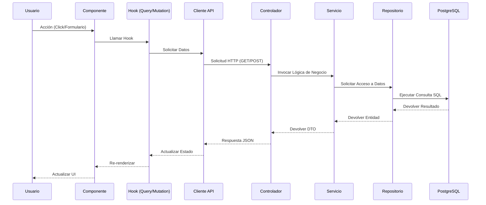
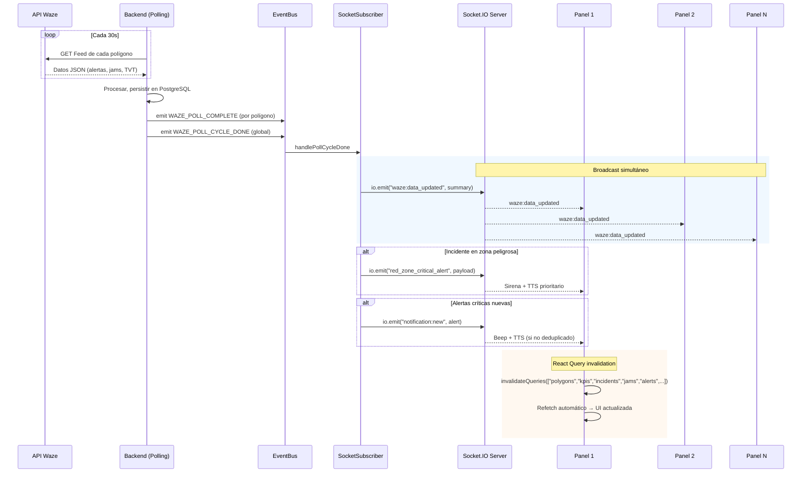
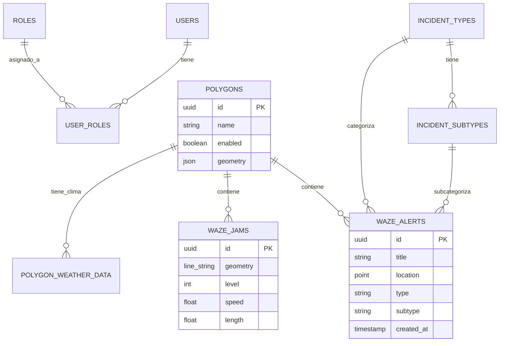

# 🏗️ Arquitectura del Sistema

## Visión General

El **Panel Ejecutivo Waze** es un sistema de monitoreo en tiempo real del tráfico vehicular que combina datos de Waze con análisis avanzado y visualización interactiva. La arquitectura está diseñada para ser **escalable**, **mantenible** y **confiable**.

## Arquitectura General



## Arquitectura Detallada

### 1. Monorepo con Workspaces NPM

```
panel-waze-monorepo/
├── apps/                          # 🖥️ Aplicaciones Principales
│   ├── frontend/                  # React + Vite + TypeScript
│   │   ├── src/
│   │   │   ├── components/        # Componentes UI
│   │   │   ├── pages/            # Páginas/Rutas
│   │   │   ├── hooks/            # Custom hooks
│   │   │   ├── utils/            # Utilidades frontend
│   │   │   └── types/            # Tipos específicos del frontend
│   │   ├── public/               # Assets estáticos
│   │   ├── index.html
│   │   └── package.json
│   └── backend/                   # Fastify + TypeScript
│       ├── src/
│       │   ├── routes/           # Definición de rutas API
│       │   ├── services/         # Lógica de negocio
│       │   ├── models/           # Modelos de datos
│       │   ├── middleware/       # Middlewares personalizados
│       │   └── utils/            # Utilidades backend
│       ├── scripts/              # Scripts de migración/setup
│       └── package.json
├── packages/                      # 📦 Paquetes Compartidos
│   ├── types/                     # 🏷️ Definiciones TypeScript
│   │   ├── src/
│   │   │   ├── api/              # Tipos de API
│   │   │   ├── database/         # Tipos de BD
│   │   │   └── common/           # Tipos comunes
│   │   └── package.json
│   ├── config/                    # ⚙️ Configuraciones
│   │   ├── src/
│   │   │   ├── constants.ts      # Constantes globales
│   │   │   ├── environments.ts   # Config por entorno
│   │   │   └── validation.ts     # Reglas de validación
│   │   └── package.json
│   ├── database/                  # 🗄️ Stub (reservado; migraciones en backend)
│   │   └── package.json
│   └── shared/                    # 🔧 Utilidades Compartidas
│       ├── src/
│       │   ├── validation/       # Funciones de validación
│       │   ├── formatting/       # Formateo de datos
│       │   ├── calculations/     # Lógica de cálculo
│       │   └── constants/        # Constantes compartidas
│       └── package.json
├── docker/                        # 🐳 Contenedorización
│   ├── Dockerfile                 # Multi-stage build
│   ├── docker-compose.yml         # Orquestación de servicios
│   └── nginx.conf                 # Configuración web server
├── docs/                          # 📚 Documentación
└── scripts/                       # 🔨 Automatización
    ├── setup.sh                   # Setup inicial
    ├── deploy.sh                  # Deployment
    └── monitoring.sh              # Monitoreo
```

## 2. Arquitectura por Capas

### Frontend Layer (React + TypeScript)

```
┌─────────────────────────────────────────────────┐
│               PRESENTATION LAYER                │
├─────────────────────────────────────────────────┤
│  🖼️  Components (UI/UX)                         │
│  📄 Pages (Routing)                            │
│  🎣 Hooks (State & Effects)                    │
│  🎨 Styles (Tailwind + Components)             │
├─────────────────────────────────────────────────┤
│               APPLICATION LAYER                 │
├─────────────────────────────────────────────────┤
│  🔄 State Management (TanStack Query)          │
│  🧭 Routing (React Router)                     │
│  📡 API Client (Custom hooks)                  │
│  🗃️  Local Storage/Cache                       │
├─────────────────────────────────────────────────┤
│               INFRASTRUCTURE LAYER              │
├─────────────────────────────────────────────────┤
│  🌐 HTTP Client (Fetch)                        │
│  🗺️  Maps (MapLibre GL JS + react-map-gl)      │
│  📊 Charts (Recharts)                          │
│  🎭 Animations (Framer Motion)                 │
└─────────────────────────────────────────────────┘
```

### Backend Layer (Fastify + TypeScript)

```
┌─────────────────────────────────────────────────┐
│               API LAYER                         │
├─────────────────────────────────────────────────┤
│  🌐 Routes & Controllers                        │
│  ✅ Validation & Sanitization                   │
│  🔐 Authentication & Authorization              │
│  📊 Response Formatting                         │
├─────────────────────────────────────────────────┤
│               BUSINESS LOGIC LAYER              │
├─────────────────────────────────────────────────┤
│  🏢 Domain Services                             │
│  🔄 Business Rules                              │
│  📈 Calculations & Analytics                    │
│  🔄 Data Processing                             │
├─────────────────────────────────────────────────┤
│               DATA ACCESS LAYER                 │
├─────────────────────────────────────────────────┤
│  🗄️  Database Models/Repositories               │
│  📡 External API Clients                        │
│  🗃️  Caching Layer (Redis, fallback en memoria)  │
│  🔄 Polling Services (Waze, clima, TVT)         │
├─────────────────────────────────────────────────┤
│               INFRASTRUCTURE LAYER              │
├─────────────────────────────────────────────────┤
│  🐘 PostgreSQL Database                         │
│  🔴 Redis Cache                                 │
│  📧 Email Services                              │
│  📱 Push Notifications                          │
└─────────────────────────────────────────────────┘
```

## 3. Patrón de Diseño

### Hexagonal Architecture (Ports & Adapters)

```
┌─────────────────────────────────────────────────┐
│                   DOMAIN                         │
│              (Business Logic)                    │
├─────────────────────────────────────────────────┤
│  ENTITIES • VALUE OBJECTS • DOMAIN SERVICES     │
└─────────────────┬───────────────────────────────┘
                  │
        ┌─────────┴─────────┐
        │                   │
┌───────▼───────┐   ┌───────▼───────┐
│   PRIMARY     │   │  SECONDARY    │
│   PORTS       │   │   PORTS       │
│ (Driven/Left) │   │ (Driving/Right)│
└───────┬───────┘   └───────┬───────┘
        │                   │
┌───────▼───────┐   ┌───────▼───────┐
│  CONTROLLERS  │   │   REPOSITORIES│
│    (API)      │   │   (Database)  │
└───────┬───────┘   └───────┬───────┘
        │                   │
┌───────▼───────────────────▼───────┐
│            FRAMEWORK               │
│         (Fastify/React)            │
└────────────────────────────────────┘
```

### CQRS (Command Query Responsibility Segregation)

```
┌─────────────────────────────────────────────────┐
│                 APPLICATION LAYER               │
├─────────────────────────────────────────────────┤
│  Commands (Write Operations)                    │
│  • CreateIncident                               │
│  • UpdatePolygon                                │
│  • DeleteUser                                   │
│  • SyncCatalogs                                 │
├─────────────────────────────────────────────────┤
│  Queries (Read Operations)                      │
│  • GetDashboardData                             │
│  • ListIncidents                                │
│  • GetUserProfile                               │
│  • GetCatalogStats                              │
├─────────────────────────────────────────────────┤
│  Handlers (Business Logic)                      │
│  • Command Handlers                             │
│  • Query Handlers                               │
│  • Event Handlers                               │
└─────────────────────────────────────────────────┘
```

## 4. Data Flow Architecture

### Diagrama de Secuencia: Flujo de Solicitud (Frontend → Backend → Base de Datos)



### Arquitectura WebSocket — Fuente Única de Verdad

El sistema usa **WebSockets (Socket.IO)** como canal primario de actualización. El backend es la **única fuente de verdad**: al completar cada ciclo de ingesta de Waze, emite un broadcast global a todos los paneles conectados simultáneamente, eliminando el antiguo sistema de polling desde el frontend.

#### Eventos WebSocket

| Evento | Dirección | Destinatario | Descripción |
|--------|-----------|-------------|-------------|
| `waze:data_updated` | Server → All clients | Broadcast global | Emitido al finalizar cada ciclo de ingesta. Todos los clientes invalidan sus caches de React Query simultáneamente. |
| `notification:new` | Server → All clients | Broadcast global | Notificación individual (accidente, peligro, etc.) para TTS y snackbar. |
| `red_zone_critical_alert` | Server → All clients | Broadcast global | Incidente en zona peligrosa RAC: sirena + TTS prioritario. |
| `play_audio_alert` | Server → All clients | Broadcast global | Emitido con alertas críticas; sonido delegado a `notification:new` / `red_zone_critical_alert`. |
| `waze:update` | Server → Room | Room `polygon:{id}` | Datos actualizados de un polígono específico. |
| `risk:update` | Server → Room | Room `polygon:{id}` | Score de riesgo (solo con `ENABLE_RISK_SCORING=1`). |

#### Diagrama de Flujo



#### Flujo en el Frontend

1. `websocket.ts` (singleton) escucha `waze:data_updated` y despacha un `CustomEvent` en `window`.
2. El hook `useGlobalRealtime()` (usado dentro de `useWazeData`) escucha ese evento y llama a `queryClient.invalidateQueries()` para todas las query keys relevantes.
3. React Query ejecuta refetch automático de las queries activas, actualizando la UI.
4. **No hay `refetchInterval`** para datos en tiempo real; los datos históricos/tendencias usan polling cada 5 minutos como excepción.

#### Browser Autoplay Policy

Los navegadores modernos bloquean la reproducción automática de audio hasta que el usuario interactúa con la página. El sistema maneja esto de la siguiente forma:

1. El operador debe hacer clic en el botón de audio (icono de altavoz) en el header del panel.
2. Este clic ejecuta `initializeAudio()`, que crea y resume un `AudioContext` y reproduce un silencio de 1ms para desbloquear la política de autoplay.
3. A partir de ese momento, tanto el TTS como los beeps de alerta (`play_audio_alert`) funcionan sin restricción.
4. El botón funciona como toggle mute/unmute, con estado persistido en `localStorage`.

### Flujo TTS y notificaciones en tiempo real

Las notificaciones nuevas llegan por Socket.IO (`notification:new`). El **único** listener que añade al store y reproduce TTS está en el cliente (`services/websocket.ts`), para evitar doble lectura:

1. **Backend** emite `notification:new` con la alerta.
2. **Frontend** (`websocket.ts`): recibe el evento → añade al store → aplica filtros TTS (`notificationFilters`) → si pasa, reproduce beep y llama a `speakNotification(mensajeTTS, "")`.
3. **TTS** (`lib/tts-service.ts`): encola el mensaje; la cola se procesa en orden llamando a `POST /api/tts/speak` (Edge TTS) o fallback Web Speech API. El estado de la cola (pendientes, si está reproduciendo) se consulta con `getTTSQueueStatus()`.

El hook `useRealtimeNotifications` no escucha `notification:new`; solo desbloquea audio con la primera interacción del usuario y reintenta TTS pendientes periódicamente. Ver [TTS.md](./TTS.md).

### Diagrama Entidad-Relación



## Arquitectura del Mapa

### Motor de renderizado

El mapa principal usa **MapLibre GL JS** a través de **react-map-gl/maplibre**, con un mapa base **raster** (OpenStreetMap claro / CARTO Dark) para evitar errores de parseo de tiles vectoriales (`unknown feature value`).

### Capas del mapa

| Capa | Tipo | Fuente |
|------|------|--------|
| Mapa base | Raster tile | OSM / CARTO rastertiles |
| Polígonos | GeoJSON fill + line | `<Source>` / `<Layer>` (react-map-gl) |
| Flujo de tráfico | GeoJSON line (animado) | `<Source>` / `<Layer>` |
| Atascos (jams) | GeoJSON line (multi-capa: brillo, núcleo, animado) | `<Source>` / `<Layer>` |
| Etiquetas de velocidad | GeoJSON symbol | `<Source>` / `<Layer>` |
| Cierres de camino | GeoJSON line (punteada) | `<Source>` / `<Layer>` |
| **Incidentes** | **Marcadores HTML (DOM)** | `maplibregl.Marker` con click nativo |

### Incidentes como Marcadores HTML

Los incidentes se renderizan como `maplibregl.Marker` con elementos DOM en lugar de capas de símbolos (`type: "symbol"`), por las siguientes razones:

- **Click fiable**: El click se maneja con `addEventListener("click")` nativo, independiente de `dragPan` y `queryRenderedFeatures`.
- **Reconciliación por ID**: Al actualizar datos (WebSocket), solo se agregan marcadores nuevos y se eliminan los que desaparecieron, sin destruir los existentes.
- **Z-index natural**: Los marcadores DOM siempre están por encima de las capas del mapa.
- **Accesibilidad**: Soporte de `role="button"`, `tabindex`, `aria-label` y navegación por teclado (Enter/Espacio).
- **prefers-reduced-motion**: Hover animado se desactiva si el usuario prefiere movimiento reducido.

### Interacción con capas vectoriales (jams, polígonos)

Para jams y polígonos se usa `queryRenderedFeatures` vía `mousedown`/`mouseup` en el canvas, con:
- **Try-catch** para capturar errores de tiles.
- **Filtro dinámico de capas** (solo consulta capas que existen en el momento).
- **Box query** de 36x36px para ampliar el área de detección en clicks.

### Minimapa

`MiniMapLibre` usa `maplibregl.Map` nativo (sin react-map-gl) con markers HTML y el basemap vectorial de CARTO (apto para modales y contextos mas pequenos).

## 5. Component Architecture

### Atomic Design Pattern

```
┌─────────────────────────────────────────────────┐
│                 ATOMIC DESIGN                    │
├─────────────────────────────────────────────────┤
│  🧩 Atoms                                        │
│  • Button, Input, Badge, Icon                   │
├─────────────────────────────────────────────────┤
│  🧬 Molecules                                    │
│  • FormField, Card, Modal, Dropdown             │
├─────────────────────────────────────────────────┤
│  🏗️  Organisms                                    │
│  • Header, Sidebar, Dashboard, Filters          │
├─────────────────────────────────────────────────┤
│  📄 Templates                                    │
│  • Page layouts, Grid systems                    │
├─────────────────────────────────────────────────┤
│  🏠 Pages                                        │
│  • Mapa, Siniestros, Incidentes, Estadísticas   │
│  • Zonas peligrosas, Notificaciones, Admin      │
│  • Login, Perfil                                │
└─────────────────────────────────────────────────┘
```

### Component Structure

```
components/
├── ui/                    # 🧩 Atomic Components
│   ├── button.tsx
│   ├── input.tsx
│   ├── card.tsx
│   └── modal.tsx
├── layout/                # 🏗️ Layout Components
│   ├── header.tsx
│   ├── sidebar.tsx
│   └── footer.tsx
├── dashboard/             # 🏠 Page Components
│   ├── executive-summary.tsx
│   ├── top-critical.tsx
│   └── metrics-cards.tsx
├── admin/                 # ⚙️ Admin Components
│   ├── user-management.tsx
│   ├── catalog-management.tsx
│   └── system-settings.tsx
└── shared/                # 🔄 Shared Components
    ├── loading.tsx
    ├── error-boundary.tsx
    └── data-table.tsx
```

## 6. State Management Strategy

### Local State (Component Level)
- **useState**: Para estado simple de componentes
- **useReducer**: Para estado complejo con múltiples acciones
- **Context**: Para estado compartido entre componentes cercanos

### Global State (Application Level)
- **TanStack Query**: Para estado del servidor (cache, sync, mutations)
- **Custom Hooks**: Para lógica de negocio reutilizable
- **Context + Reducer**: Para estado global de UI (modales, notificaciones)

### Server State Management
```
┌─────────────────────────────────────────────────┐
│              SERVER STATE PATTERN                │
├─────────────────────────────────────────────────┤
│  📡 API Layer (TanStack Query)                  │
│  • Cache management                             │
│  • Background refetch                           │
│  • Optimistic updates                           │
│  • Error handling                               │
├─────────────────────────────────────────────────┤
│  🎣 Custom Hooks                                │
│  • Domain-specific logic                        │
│  • Data transformation                          │
│  • Loading states                               │
├─────────────────────────────────────────────────┤
│  🧩 Components                                  │
│  • UI rendering                                 │
│  • User interactions                            │
│  • Local state only                             │
└─────────────────────────────────────────────────┘
```

## 7. Error Handling Strategy

### Frontend Error Boundaries
```
┌─────────────────────────────────────────────────┐
│            ERROR BOUNDARY HIERARCHY             │
├─────────────────────────────────────────────────┤
│  🏠 Page Level                                  │
│  • Catch page-level errors                      │
│  • Show fallback UI                             │
│  • Report to monitoring                         │
├─────────────────────────────────────────────────┤
│  🏗️  Component Level                             │
│  • Catch component errors                       │
│  • Graceful degradation                         │
│  • User-friendly messages                       │
├─────────────────────────────────────────────────┤
│  🔧 Hook Level                                  │
│  • Handle API errors                            │
│  • Retry logic                                  │
│  • Error reporting                              │
├─────────────────────────────────────────────────┤
│  📡 API Level                                   │
│  • Network error handling                       │
│  • Timeout handling                             │
│  • Response validation                          │
└─────────────────────────────────────────────────┘
```

### Backend Error Handling
```
┌─────────────────────────────────────────────────┐
│            ERROR HANDLING STRATEGY              │
├─────────────────────────────────────────────────┤
│  🌐 HTTP Layer                                  │
│  • Request validation                           │
│  • Rate limiting                                │
│  • CORS handling                                │
├─────────────────────────────────────────────────┤
│  🏢 Business Layer                              │
│  • Domain validation                            │
│  • Business rule enforcement                    │
│  • Data integrity checks                        │
├─────────────────────────────────────────────────┤
│  🗄️  Data Layer                                  │
│  • Connection error handling                    │
│  • Transaction rollback                         │
│  • Constraint violation handling                │
├─────────────────────────────────────────────────┤
│  📊 Monitoring Layer                            │
│  • Error logging                                │
│  • Performance metrics                          │
│  • Alert generation                             │
└─────────────────────────────────────────────────┘
```

## 8. Security Architecture

### Authentication & Authorization
```
┌─────────────────────────────────────────────────┐
│           SECURITY ARCHITECTURE                  │
├─────────────────────────────────────────────────┤
│  🔐 Authentication                              │
│  • JWT tokens                                   │
│  • SSO (Microsoft/Google)                       │
│  • Session management                           │
├─────────────────────────────────────────────────┤
│  🛡️  Authorization                               │
│  • Role-based access control                    │
│  • Permission-based access                      │
│  • Route protection                             │
├─────────────────────────────────────────────────┤
│  🔒 Data Protection                              │
│  • Input sanitization                           │
│  • SQL injection prevention                     │
│  • XSS protection                               │
├─────────────────────────────────────────────────┤
│  📡 API Security                                │
│  • Rate limiting                                │
│  • Request validation                           │
│  • CORS configuration                           │
└─────────────────────────────────────────────────┘
```

## 9. Performance Optimization

### Frontend Optimizations
- **Code Splitting**: Lazy loading de rutas y componentes
- **Bundle Optimization**: Tree shaking y minificación
- **Image Optimization**: WebP, lazy loading, compression
- **Caching**: Service worker para assets estáticos
- **Virtual Scrolling**: Para listas grandes

### Backend Optimizations
- **Database Indexing**: Índices estratégicos en consultas frecuentes
- **Query Optimization**: N+1 problem prevention
- **Caching**: Redis para datos frecuentemente accedidos
- **Compression**: GZIP/Brotli en responses
- **Connection Pooling**: PostgreSQL connection pooling

### Infrastructure Optimizations
- **CDN**: Para assets estáticos
- **Load Balancing**: Distribución de carga
- **Database Replication**: Read replicas
- **Horizontal Scaling**: Microservicios preparados

## 10. Deployment Architecture

### Development Environment
```
┌─────────────────────────────────────────────────┐
│            DEVELOPMENT ENVIRONMENT              │
├─────────────────────────────────────────────────┤
│  🖥️  Local Development                           │
│  • Hot reload (Vite)                           │
│  • API proxy                                    │
│  • Local database                               │
├─────────────────────────────────────────────────┤
│  🐳 Docker Development                           │
│  • docker-compose.dev.yml                       │
│  • Hot reload containers                        │
│  • Volume mounting                              │
└─────────────────────────────────────────────────┘
```

### Production Environment
```
┌─────────────────────────────────────────────────┐
│            PRODUCTION ENVIRONMENT               │
├─────────────────────────────────────────────────┤
│  🐳 Containerized Deployment                    │
│  • Multi-stage Docker builds                    │
│  • Nginx reverse proxy                          │
│  • SSL/TLS termination                          │
├─────────────────────────────────────────────────┤
│  ☁️  Cloud Infrastructure                        │
│  • Load balancer                                │
│  • Auto scaling                                 │
│  • Database replication                         │
├─────────────────────────────────────────────────┤
│  📊 Monitoring & Observability                   │
│  • Health checks                                │
│  • Application metrics                          │
│  • Log aggregation                              │
│  • Error tracking                               │
└─────────────────────────────────────────────────┘
```

## 11. Testing Strategy

### Testing Pyramid
```
┌─────────────────────────────────────────────────┐
│               TESTING PYRAMID                   │
├─────────────────────────────────────────────────┤
│  🤖 E2E Tests (Playwright)                       │
│  • Critical user journeys                       │
│  • Cross-browser compatibility                  │
│  • Integration testing                          │
├─────────────────────────────────────────────────┤
│  🔧 Integration Tests                           │
│  • API endpoints                                │
│  • Database operations                          │
│  • External service integration                 │
├─────────────────────────────────────────────────┤
│  🧪 Unit Tests (Jest)                            │
│  • Business logic                               │
│  • Utility functions                            │
│  • Component logic                              │
├─────────────────────────────────────────────────┤
│  🏗️  Architecture Tests                          │
│  • Dependency injection                         │
│  • Layer isolation                              │
│  • Contract testing                             │
└─────────────────────────────────────────────────┘
```

## Conclusión

Esta arquitectura proporciona una base sólida para el **Panel Ejecutivo Waze**, permitiendo:

- **Escalabilidad**: Monorepo con workspaces facilita el crecimiento
- **Mantenibilidad**: Separación clara de responsabilidades
- **Performance**: Optimizaciones en múltiples capas
- **Confiabilidad**: Health checks y error handling robusto
- **Seguridad**: Autenticación y autorización comprehensiva
- **Observabilidad**: Logging y monitoring integrado

La arquitectura está diseñada para evolucionar con los requerimientos del negocio, manteniendo la calidad y performance del sistema.

