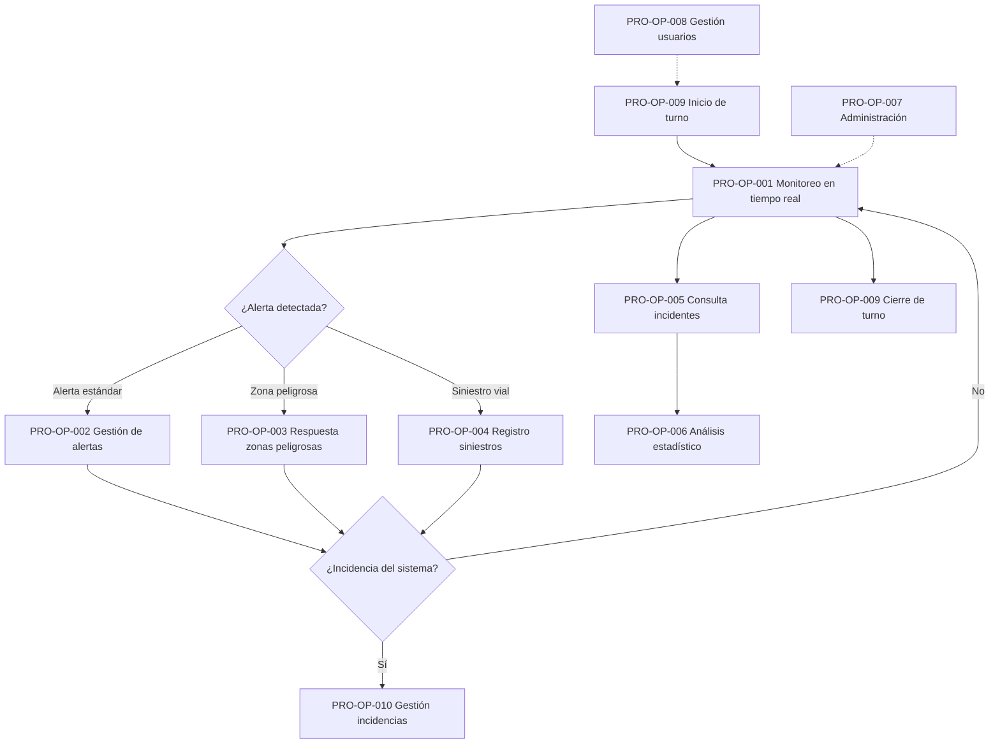

# Manual de Procesos Operativos

**Código:** SGC-PWY-MP-001  
**Proyecto:** Panel Ejecutivo Waze – Monitoreo de Tráfico en Tiempo Real  
**Organización:** CASISA – Caminos de las Sierras  
**Versión:** 1.0  
**Fecha:** Junio 2026  
**Cláusula ISO 9001:2015:** 8.1, 8.5 — Planificación y control operacional

---

## Tabla de contenidos

1. [Introducción](#1-introducción)
2. [Mapa de procesos](#2-mapa-de-procesos)
3. [PRO-OP-001: Monitoreo de tráfico en tiempo real](#3-pro-op-001-monitoreo-de-tráfico-en-tiempo-real)
4. [PRO-OP-002: Gestión de alertas y notificaciones](#4-pro-op-002-gestión-de-alertas-y-notificaciones)
5. [PRO-OP-003: Respuesta a zonas peligrosas](#5-pro-op-003-respuesta-a-zonas-peligrosas)
6. [PRO-OP-004: Registro de siniestros viales](#6-pro-op-004-registro-de-siniestros-viales)
7. [PRO-OP-005: Consulta de incidentes e histórico](#7-pro-op-005-consulta-de-incidentes-e-histórico)
8. [PRO-OP-006: Análisis estadístico operativo](#8-pro-op-006-análisis-estadístico-operativo)
9. [PRO-OP-007: Administración del sistema](#9-pro-op-007-administración-del-sistema)
10. [PRO-OP-008: Gestión de usuarios y accesos](#10-pro-op-008-gestión-de-usuarios-y-accesos)
11. [PRO-OP-009: Inicio y cierre de turno](#11-pro-op-009-inicio-y-cierre-de-turno)
12. [PRO-OP-010: Gestión de incidencias operativas](#12-pro-op-010-gestión-de-incidencias-operativas)
13. [Indicadores de proceso](#13-indicadores-de-proceso)
14. [Referencias cruzadas](#14-referencias-cruzadas)

---

## 1. Introducción

### 1.1 Propósito

Este manual describe los **procesos operativos** que CASISA ejecuta a través del Panel Ejecutivo Waze para monitorear el tráfico vehicular. Cada proceso documenta sus entradas, actividades, salidas, responsables y registros asociados.

### 1.2 Alcance

Este manual aplica a los procesos de sala de control y a las tareas de administración del sistema en el entorno de producción.

### 1.3 Definiciones

| Término | Definición |
|---------|------------|
| Operador | Usuario de sala de control con rol Operador o superior |
| Supervisor | Usuario con rol Supervisor, responsable de validar acciones operativas |
| Ciclo de ingesta | Intervalo de ~30 s en que el backend consulta feeds Waze y actualiza datos |
| Zona peligrosa | Área geográfica delimitada donde un incidente genera alerta crítica |
| RAC | Registro de Accidentes y Siniestros viales |

---

## 2. Mapa de procesos

---

## 3. PRO-OP-001: Monitoreo de tráfico en tiempo real

| Campo | Valor |
|-------|-------|
| **Código** | PRO-OP-001 |
| **Responsable** | Operador de sala de control |
| **Frecuencia** | Continua (24/7 en producción) |
| **Módulo** | `/mapa` |

### Entradas

- Feed Waze CCP (alertas, jams, irregularities)
- Datos meteorológicos Open-Meteo
- Configuración de polígonos de monitoreo
- Sesión de usuario autenticada

### Actividades

| Paso | Actividad | Responsable |
|------|-----------|-------------|
| 1 | Iniciar sesión y habilitar audio (ver PRO-OP-009) | Operador |
| 2 | Abrir módulo Mapa (`/mapa`) | Operador |
| 3 | Verificar indicador de conexión WebSocket (verde) | Operador |
| 4 | Observar mapa: marcadores, polígonos, jams | Operador |
| 5 | Revisar KPIs laterales: incidentes activos, polígonos críticos | Operador |
| 6 | Aplicar filtros si se requiere foco en zona o tipo | Operador |
| 7 | Consultar detalle de incidente (clic en marcador) | Operador |
| 8 | El sistema actualiza automáticamente cada ~30 s vía WebSocket | Sistema |

### Salidas

- Visualización actualizada del estado de tráfico
- Identificación de situaciones que requieren acción (alertas, zonas críticas)
- Registro implícito en logs del backend

### Registros

- Logs de polling Waze (`wazePollingService`)
- Eventos WebSocket `waze:data_updated`
- Datos en tablas `waze_alerts`, `waze_jams`, `waze_irregularities`

### Criterios de conformidad

- [ ] Mapa carga con polígonos visibles
- [ ] Indicador WebSocket en estado conectado
- [ ] Datos actualizados en últimos 60 segundos
- [ ] KPIs reflejan conteo coherente con marcadores

---

## 4. PRO-OP-002: Gestión de alertas y notificaciones

| Campo | Valor |
|-------|-------|
| **Código** | PRO-OP-002 |
| **Responsable** | Operador de sala de control |
| **Disparador** | Evento `notification:new` vía WebSocket |
| **Módulo** | `/mapa`, `/notificaciones` |

### Entradas

- Alerta Waze nueva (accidente, peligro, clima, congestión)
- Configuración de filtros TTS
- Estado de audio del navegador (habilitado/deshabilitado)

### Actividades

| Paso | Actividad | Responsable |
|------|-----------|-------------|
| 1 | El sistema recibe `notification:new` y muestra snackbar | Sistema |
| 2 | Si audio activo: reproducir beep + TTS con descripción del incidente | Sistema |
| 3 | Operador lee la alerta en snackbar o panel de notificaciones | Operador |
| 4 | Operador evalúa severidad y ubicación | Operador |
| 5 | Si requiere acción operativa externa: comunicar a patrulla/gerencia | Operador |
| 6 | Marcar notificación como leída | Operador |
| 7 | Si es falsa alarma o dato incorrecto: reportar incidencia (PRO-OP-010) | Operador |

### Salidas

- Alerta atendida y marcada como leída
- Comunicación externa si aplica (fuera del sistema)
- Incidencia registrada si hay anomalía de datos

### Registros

- Tabla `notifications`
- Store local de notificaciones (frontend)
- Log de eventos TTS

---

## 5. PRO-OP-003: Respuesta a zonas peligrosas

| Campo | Valor |
|-------|-------|
| **Código** | PRO-OP-003 |
| **Responsable** | Operador de sala de control |
| **Disparador** | Evento `red_zone_critical_alert` vía WebSocket |
| **Módulo** | `/zonas-peligrosas`, `/mapa` |

### Entradas

- Incidente Waze dentro de polígono de zona peligrosa
- Configuración de zonas peligrosas (`zonas_peligrosas`)
- Nivel de peligrosidad de la zona

### Actividades

| Paso | Actividad | Responsable |
|------|-----------|-------------|
| 1 | El sistema detecta incidente dentro de zona peligrosa | Sistema |
| 2 | Emite `red_zone_critical_alert`: **sirena + TTS prioritario** | Sistema |
| 3 | Operador identifica la zona y el incidente en el mapa | Operador |
| 4 | Operador evalúa nivel de riesgo según configuración de la zona | Operador |
| 5 | Activar protocolo operativo CASISA según severidad | Operador / Supervisor |
| 6 | Documentar acción tomada (comunicación, cierre de carril, etc.) | Operador |
| 7 | Verificar resolución del incidente en mapa | Operador |

### Salidas

- Respuesta operativa activada según protocolo CASISA
- Incidente monitoreado hasta resolución
- Registro en bitácora operativa (externa al sistema)

### Registros

- Evento `red_zone_critical_alert` en logs WebSocket
- Datos en `zonas_peligrosas` y `waze_alerts`
- Notificación en store con flag `isRedZone`

### Criterios de conformidad

- [ ] Alerta sonora se reproduce dentro de 5 segundos del incidente
- [ ] TTS incluye ubicación y tipo de incidente
- [ ] No se duplica lectura TTS (deduplicación activa)

---

## 6. PRO-OP-004: Registro de siniestros viales

| Campo | Valor |
|-------|-------|
| **Código** | PRO-OP-004 |
| **Responsable** | Operador (crear), Supervisor (validar) |
| **Permisos** | `accidents.view`, `accidents.create`, `accidents.export` |
| **Módulo** | `/siniestros` |

### Entradas

- Información del siniestro (ubicación, fecha, tipo, descripción)
- Coordenadas GPS o selección en mapa
- Multimedia opcional (fotos, videos)
- Datos de rutas y mojones kilométricos

### Actividades

| Paso | Actividad | Responsable |
|------|-----------|-------------|
| 1 | Acceder a `/siniestros` | Operador |
| 2 | Presionar "Nuevo siniestro" | Operador |
| 3 | Completar formulario: ubicación, fecha/hora, tipo, descripción | Operador |
| 4 | Seleccionar ubicación en mini-mapa o ingresar coordenadas | Operador |
| 5 | Adjuntar multimedia si está disponible | Operador |
| 6 | Guardar registro | Operador |
| 7 | El sistema consulta clima histórico automáticamente (Open-Meteo) | Sistema |
| 8 | Verificar resumen meteorológico interpretado en detalle | Operador |
| 9 | Si clima vacío: ejecutar "Actualizar clima" (hasta 92 días) | Operador |
| 10 | Exportar PDF si se requiere documentación formal | Operador |
| 11 | Supervisor valida datos del registro | Supervisor |

### Salidas

- Registro en tabla `road_accidents` con clima histórico
- PDF exportado (si aplica)
- Geo-referencia con mojón kilométrico más cercano

### Registros

- Tabla `road_accidents` y `accident_media`
- Datos meteorológicos asociados al siniestro
- PDF generado (archivo local del operador)

### Criterios de conformidad

- [ ] Campos obligatorios completos
- [ ] Ubicación con coordenadas válidas
- [ ] Clima histórico presente o justificación documentada
- [ ] Supervisor validó el registro

---

## 7. PRO-OP-005: Consulta de incidentes e histórico

| Campo | Valor |
|-------|-------|
| **Código** | PRO-OP-005 |
| **Responsable** | Operador, Supervisor |
| **Permiso** | `incidents.view` |
| **Módulo** | `/incidentes`, `/incidentes/historico` |

### Entradas

- Criterios de búsqueda (tipo, fecha, polígono, texto)
- Datos históricos en BD

### Actividades

| Paso | Actividad | Responsable |
|------|-----------|-------------|
| 1 | Acceder a `/incidentes` | Usuario |
| 2 | Aplicar filtros: tipo, rango de fechas, polígono | Usuario |
| 3 | Revisar listado paginado de incidentes | Usuario |
| 4 | Para histórico: navegar a `/incidentes/historico` | Usuario |
| 5 | Exportar resultados si tiene permiso `incidents.export` | Usuario |

### Salidas

- Listado filtrado de incidentes
- Exportación de datos (si aplica)

### Registros

- Consultas registradas en logs de API
- Datos de `waze_alerts`, `incidents_history`

---

## 8. PRO-OP-006: Análisis estadístico operativo

| Campo | Valor |
|-------|-------|
| **Código** | PRO-OP-006 |
| **Responsable** | Supervisor |
| **Permiso** | `incidents.view` |
| **Módulo** | `/estadisticas` |
| **Frecuencia** | Diaria / semanal / según necesidad |

### Entradas

- Datos históricos agregados (diarios, semanales, mensuales)
- Configuración de polígonos y grupos

### Actividades

| Paso | Actividad | Responsable |
|------|-----------|-------------|
| 1 | Acceder a `/estadisticas` | Supervisor |
| 2 | Revisar tendencias de incidentes | Supervisor |
| 3 | Analizar hotspots (zonas de alta concentración) | Supervisor |
| 4 | Evaluar disponibilidad de datos Waze | Supervisor |
| 5 | Comparar métricas entre grupos de polígonos | Supervisor |
| 6 | Elaborar informe o comunicar hallazgos a gerencia | Supervisor |

### Salidas

- Informe de tendencias (externo al sistema)
- Decisiones sobre ajuste de polígonos o zonas peligrosas
- Input para revisión por dirección (cláusula 9.3 ISO)

### Registros

- Datos de `/api/stats/daily|weekly|monthly`
- Datos de `/api/historical/trends`, `/api/historical/incidents/hotspots`

---

## 9. PRO-OP-007: Administración del sistema

| Campo | Valor |
|-------|-------|
| **Código** | PRO-OP-007 |
| **Responsable** | Administrador |
| **Permiso** | `admin` |
| **Módulo** | `/admin` |

### 9.1 Gestión de polígonos

| Paso | Actividad |
|------|-----------|
| 1 | Admin → Polígonos Waze |
| 2 | Crear/editar/eliminar polígonos de monitoreo |
| 3 | Configurar feed URL y parámetros de cada polígono |
| 4 | Importar/exportar configuración CSV |
| 5 | Verificar que el polling Waze incluye el polígono nuevo |

### 9.2 Gestión de catálogos

| Paso | Actividad |
|------|-----------|
| 1 | Admin → Catálogos |
| 2 | Revisar tipos y subtipos de incidentes |
| 3 | Ejecutar sincronización con Waze si hay cambios |
| 4 | Crear/editar tipos personalizados si aplica |

### 9.3 Gestión de mojones kilométricos

| Paso | Actividad |
|------|-----------|
| 1 | Admin → Mojones Kilométricos |
| 2 | Crear/editar/eliminar hitos por ruta |
| 3 | Verificar geo-referencia en alertas nuevas |

### 9.4 Configuración del sistema

| Paso | Actividad |
|------|-----------|
| 1 | Admin → Configuración Sistema |
| 2 | Ajustar parámetros TTS (voz, velocidad, filtros) |
| 3 | Configurar umbrales de alerta y retención |
| 4 | Verificar health check tras cambios |

### Registros

- Cambios en tablas `polygons`, `catalogs`, `kilometer_markers`
- Commits Git si el cambio requiere despliegue
- Log de auditoría de cambios administrativos

---

## 10. PRO-OP-008: Gestión de usuarios y accesos

| Campo | Valor |
|-------|-------|
| **Código** | PRO-OP-008 |
| **Responsable** | Administrador |
| **Permiso** | `admin` |
| **Módulo** | `/admin` → Usuarios y Perfiles |

### Actividades

| Paso | Actividad | Responsable |
|------|-----------|-------------|
| 1 | Recibir solicitud de alta/baja de usuario | Administrador |
| 2 | Crear usuario con email, nombre y rol | Administrador |
| 3 | Asignar rol según función (Operador, Supervisor, etc.) | Administrador |
| 4 | Verificar permisos efectivos en vista de preview | Administrador |
| 5 | Comunicar credenciales al usuario por canal seguro | Administrador |
| 6 | En baja: desactivar usuario y revocar sesiones | Administrador |

### Salidas

- Usuario creado/modificado/desactivado
- Sesiones revocadas si aplica

### Registros

- Tabla `users`, `roles`, `permissions`, `sessions`
- Solicitud de alta/baja (ticket o email)

### Criterios de conformidad

- [ ] Principio de mínimo privilegio aplicado
- [ ] Credenciales entregadas por canal seguro (no por email sin cifrar)
- [ ] Usuario inactivo no puede iniciar sesión

---

## 11. PRO-OP-009: Inicio y cierre de turno

| Campo | Valor |
|-------|-------|
| **Código** | PRO-OP-009 |
| **Responsable** | Operador de sala de control |
| **Frecuencia** | Por turno |

### 11.1 Inicio de turno

| Paso | Actividad | Verificación |
|------|-----------|--------------|
| 1 | Encender equipos de sala de control | Hardware operativo |
| 2 | Abrir navegador → http://10.1.0.136/ | Página de login carga |
| 3 | Iniciar sesión con credenciales personales | Redirige a `/mapa` |
| 4 | **Clic en icono de audio** (altavoz) | Audio habilitado |
| 5 | Verificar indicador WebSocket: conectado | Estado verde |
| 6 | Verificar `/health` si hay dudas (opcional) | HTTP 200 |
| 7 | Revisar notificaciones pendientes del turno anterior | Listado en `/notificaciones` |
| 8 | Confirmar con supervisor relevo de situación | Comunicación verbal |

### 11.2 Cierre de turno

| Paso | Actividad |
|------|-----------|
| 1 | Informar al relevo situación actual (incidentes activos, zonas críticas) |
| 2 | Marcar notificaciones pendientes como leídas o informar al relevo |
| 3 | Cerrar sesión (sidebar → Cerrar sesión) |
| 4 | Apagar o bloquear equipo según política CASISA |

### Registros

- Sesión de login/logout en tabla `sessions`
- Bitácora operativa de turno (externa)

---

## 12. PRO-OP-010: Gestión de incidencias operativas

| Campo | Valor |
|-------|-------|
| **Código** | PRO-OP-010 |
| **Responsable** | Operador (detecta), Supervisor (gestiona) |
| **Vinculación ISO** | PROC-006 (No conformidades) |

### Entradas

- Comportamiento anómalo del sistema detectado por el operador
- Falla de servicio reportada por monitoreo

### Actividades

| Paso | Actividad | Responsable |
|------|-----------|-------------|
| 1 | Detectar anomalía (mapa vacío, sin audio, error de login, etc.) | Operador |
| 2 | Intentar resolución básica (refrescar, re-login, verificar audio) | Operador |
| 3 | Si persiste: reportar al supervisor con descripción y captura | Operador |
| 4 | Supervisor clasifica severidad (crítica/mayor/menor) | Supervisor |
| 5 | Si crítica: contactar GED / admin sistemas | Supervisor |
| 6 | Registrar NC conforme a PROC-006 | Supervisor |
| 7 | Verificar resolución y cerrar NC | Supervisor |

### Salidas

- Incidencia resuelta o escalada
- NC registrada si aplica
- AC implementada si hay recurrencia

### Registros

- Formato NC-PWY-YYYY-NNN (PROC-006)
- Ticket o issue en sistema de seguimiento

---

## 13. Indicadores de proceso

| ID | Proceso | Indicador | Meta | Frecuencia | Registro |
|----|---------|-----------|------|------------|----------|
| IP-01 | PRO-OP-001 | Tiempo de actualización de datos en mapa | ≤ 30 s | Continuo | [RP-001](./registros/RP-001_Registro_Monitoreo.md) |
| IP-02 | PRO-OP-002 | Alertas atendidas en < 2 min | ≥ 95% | Diario | [RP-002](./registros/RP-002_Registro_Alertas.md) |
| IP-03 | PRO-OP-003 | Tiempo de respuesta a zona peligrosa | ≤ 5 s (alerta sonora) | Por evento | [RP-003](./registros/RP-003_Registro_Zonas_Peligrosas.md) |
| IP-04 | PRO-OP-004 | Siniestros con clima histórico completo | ≥ 90% | Mensual | [RP-004](./registros/RP-004_Registro_Siniestros.md) |
| IP-05 | PRO-OP-009 | Turnos con audio habilitado al inicio | 100% | Diario | [RP-009](./registros/RP-009_Bitacora_Turno.md) |
| IP-06 | PRO-OP-010 | NC críticas abiertas > 48 h | 0 | Semanal | [RP-010](./registros/RP-010_Registro_No_Conformidades.md) |

---

## 14. Referencias cruzadas

| Documento | Relación |
|-----------|----------|
| [MANUAL_USUARIO.md](./MANUAL_USUARIO.md) | Instrucciones detalladas de uso por módulo |
| [instructivos/](./instructivos/README.md) | Instructivos paso a paso IP-001 a IP-010 por proceso |
| [registros/](./registros/README.md) | Registros de evidencia RP-001 a RP-010 por proceso |
| [PROC-006_No_Conformidades_Mejora.md](./PROC-006_No_Conformidades_Mejora.md) | Gestión de NC operativas |
| [MANUAL_SGC_ISO9001.md](./MANUAL_SGC_ISO9001.md) | Marco del SGC |
| [TTS.md](../TTS.md) | Detalle técnico de alertas de voz |
| [API.md](../API.md) | Endpoints utilizados por los procesos |

---

**Historial de revisiones**

| Versión | Fecha | Cambio | Autor |
|---------|-------|--------|-------|
| 1.0 | 2026-06-08 | Emisión inicial con 10 procesos operativos | GED |

| Campo | Valor |
|-------|-------|
| Elaborado por | GED – CASISA |
| Revisado por | _Pendiente_ |
| Aprobado por | _Pendiente_ |
| Próxima revisión | Diciembre 2026 |
